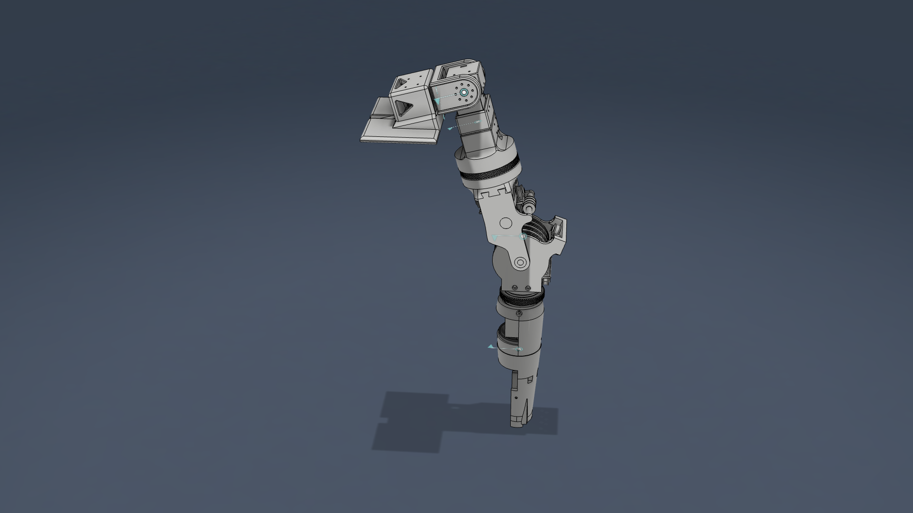

# harper_arm — Robot Description



*Note: This is still a work in progress.*

## Overview

| Property | Value |
|----------|-------|
| Total mass | 1.615 kg |
| Links | 6 |
| Joints | 5 (5 movable) |
| Assemblies | 1 |
| Root link | `base_link` |

## Table of Contents

- [Kinematic Tree](#kinematic-tree)
- [Link Properties](#link-properties)
- [Joint Properties](#joint-properties)
- [Assembly Breakdown](#assembly-breakdown)
- [Quick Start (ROS 2)](#quick-start-ros-2)
- [Files](#files)

## Kinematic Tree

```
base_link
  └─ shoulder_flexion_joint [revolute]
    ubracket_link [BAKE]
      └─ shoulder_abduction_joint [revolute]
        abduction_link [BAKE]
          └─ shoulder_rotation_joint [continuous]
            shoulder_rot_link
              └─ elbow_flexion_joint [revolute]
                elbow_forearm_link [BAKE]
                  └─ forearm_rotation_joint [continuous]
                    forearm_front_link [BAKE]
```

## Link Properties

| Link | Mass (kg) | Material | Collision | Bodies |
|------|-----------|----------|-----------|--------|
| `abduction_link` | 0.1706 | ABS_Plastic | box | 2 |
| `base_link` | 0.2161 | ABS_Plastic | box | 1 |
| `elbow_forearm_link` | 0.6238 | ABS_Plastic | box | 7 |
| `forearm_front_link` | 0.0773 | ABS_Plastic | box | 1 |
| `shoulder_rot_link` | 0.4703 | ABS_Plastic | box | 1 |
| `ubracket_link` | 0.0568 | ABS_Plastic | box | 1 |

## Joint Properties

| Joint | Type | Parent → Child | Axis | Limits |
|-------|------|---------------|------|--------|
| `elbow_flexion_joint` | revolute | `shoulder_rot_link` → `elbow_forearm_link` | (1,0,0) | [-80.0°, 35.0°] |
| `forearm_rotation_joint` | continuous | `elbow_forearm_link` → `forearm_front_link` | (-1,-0,-0) | — |
| `shoulder_abduction_joint` | revolute | `ubracket_link` → `abduction_link` | (-1,0,-0) | [-15.0°, 180.0°] |
| `shoulder_flexion_joint` | revolute | `base_link` → `ubracket_link` | (-0,1,-0) | [-180.0°, 90.0°] |
| `shoulder_rotation_joint` | continuous | `abduction_link` → `shoulder_rot_link` | (0,0,1) | — |

## Assembly Breakdown

### harper_arm

- **Links**: base_link, ubracket_link, abduction_link, shoulder_rot_link, elbow_forearm_link, forearm_front_link
- **Total mass**: 1.615 kg

## Quick Start (ROS 2)

```bash
# 1. Copy package to your ROS 2 workspace
cp -r harper_arm_description ~/ros2_ws/src/

# 2. Build
cd ~/ros2_ws
colcon build --packages-select harper_arm_description
source install/setup.bash

# 3. Visualize in RViz2
ros2 launch harper_arm_description display.launch.py

# 4. Validate URDF structure
check_urdf install/harper_arm_description/share/harper_arm_description/urdf/harper_arm.urdf

# 5. Print kinematic tree
urdf_to_graphviz install/harper_arm_description/share/harper_arm_description/urdf/harper_arm.urdf
```

**Joint control**: The launch file includes `joint_state_publisher_gui` —
use the sliders to move revolute/prismatic joints in RViz2.

**Topic inspection**:
```bash
# See published joint states
ros2 topic echo /joint_states

# See robot description parameter
ros2 param get /robot_state_publisher robot_description
```

## Files

| Path | Description |
|------|-------------|
| `urdf/harper_arm.urdf.xacro` | Top-level xacro (entry point) |
| `urdf/harper_arm.urdf` | Flat URDF (for validation) |
| `urdf/assemblies/` | Per-assembly xacro macros |
| `meshes/` | Visual (OBJ) and collision (STL) meshes |
| `launch/display.launch.py` | Launch robot_state_publisher, RViz, and generated controllers |
| `config/joint_state.yaml` | Joint state publisher config |
| `config/ros2_controllers.yaml` | Generated ros2_control controller manager config |
| `robot_data.yaml` | Supplementary data (beyond URDF) |
| `docs/transforms.md` | Transformation matrices (KaTeX) |

## Customizing

Assemblies tagged `!dummy_` are designed to be swapped out. To replace one:

1. Create your replacement as a xacro macro with the same interface
2. Place it in `urdf/assemblies/`
3. Update the `<xacro:include>` in `urdf/harper_arm.urdf.xacro`
4. Update meshes in `meshes/<your_assembly>/`

The xacro prefix system (`${prefix}`) ensures link names stay unique
when multiple instances of the same assembly are used.

---
*Generated by Fusion URDF/XACRO Exporter v3.0.0*